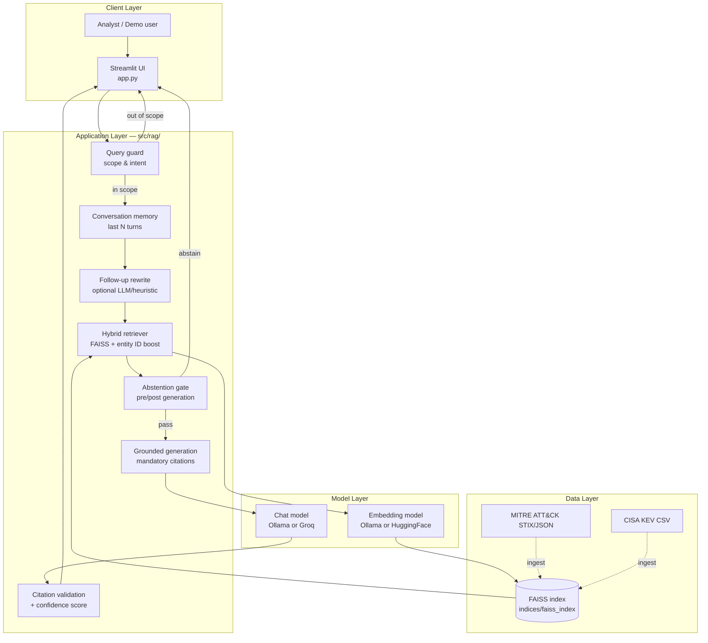

# Threat Intelligence Assistant

A **retrieval-augmented generation (RAG)** chat application that helps security analysts explore **MITRE ATT&CK** and **CISA Known Exploited Vulnerabilities (KEV)** with **grounded, cited, explainable** answers — not open-web speculation.

---

## 🎯 Problem & Motivation

Threat analysts routinely pivot between MITRE technique pages, group profiles, software entries, and CISA KEV bulletins. General-purpose LLMs can sound confident while **hallucinating technique IDs, CVEs, or attributions** — a serious failure mode in security workflows.

This project asks: *Can a small, transparent RAG pipeline deliver fast, analyst-friendly answers that stay tied to authoritative sources?*

**Goals:**
- Ground every answer in retrieved MITRE / KEV context
- Require inline citations and surface source links in the UI
- Score confidence explicitly and abstain when evidence is weak
- Block off-topic or vague prompts before wasting retrieval + LLM calls

---

## 🛠️ Tech Stack


| Layer | Local development | Cloud deployment |
|-------|-------------------|------------------|
| **UI** | Streamlit (`app.py`) | Streamlit Community Cloud |
| **Orchestration** | LangChain | LangChain |
| **LLM** | Ollama `gemma3:4b` | Groq `llama-3.1-8b-instant` |
| **Embeddings** | Ollama `nomic-embed-text` | HuggingFace `nomic-ai/nomic-embed-text-v1` (pinned revision) |
| **Vector store** | FAISS (committed index) | FAISS (committed index) |
| **Config** | Pydantic Settings + `.env` | Streamlit Secrets + env |
| **Tests** | pytest (48 tests) | Same pipeline via `validation_matrix.py` |

---

## 📊 Data Sources & Attribution

This project indexes **MITRE ATT&CK Enterprise** STIX data and the **CISA Known Exploited Vulnerabilities (KEV)** catalog. The committed FAISS index is built from these sources only.

**Datasets used** (saved under `data/raw/`):

| File | Source | What it provides |
|------|--------|------------------|
| `enterprise-attack.json` | [MITRE ATT&CK STIX data](https://github.com/mitre-attack/attack-stix-data) | Techniques, sub-techniques, tactics, groups (`G####`), software (`S####`) |
| `known_exploited_vulnerabilities.csv` | [CISA KEV catalog](https://www.cisa.gov/known-exploited-vulnerabilities-catalog) | Actively exploited CVEs, vendors, products, remediation deadlines |

**Indexed corpus (v1.0.0):** 3,306 documents → 3,312 chunks — 697 techniques, 174 groups, 821 software, 1,614 KEV entries.

**License compliance**

| Data | License / terms |
|------|-----------------|
| MITRE ATT&CK | © [The MITRE Corporation](https://attack.mitre.org/). Non-exclusive, royalty-free license for research, development, and commercial use — see [attack-stix-data LICENSE](https://github.com/mitre-attack/attack-stix-data?tab=License-1-ov-file#readme) and [ATT&CK Terms of Use](https://attack.mitre.org/resources/terms-of-use/). Reproduce MITRE’s copyright notice in any copy. |
| CISA KEV | [CC0 1.0 Universal](https://www.cisa.gov/sites/default/files/licenses/kev/license.txt) — public domain dedication. Does not authorize use of the CISA logo or DHS seal. |

**Models used at runtime** (not redistributed in this repo):

| Model | Role | License / acknowledgment |
|-------|------|--------------------------|
| [nomic-ai/nomic-embed-text-v1](https://huggingface.co/nomic-ai/nomic-embed-text-v1) | Cloud query embeddings (Streamlit) | [Apache 2.0](https://huggingface.co/nomic-ai/nomic-embed-text-v1) — see [Nomic Embed technical report (arXiv:2402.01613)](https://arxiv.org/abs/2402.01613) |
| `nomic-embed-text` (Ollama) | Local index build + local dev embeddings | Same model family as above |
| `gemma3:4b` (Ollama) | Local dev LLM | [Gemma Terms of Use](https://ai.google.dev/gemma/terms) |
| `llama-3.1-8b-instant` (Groq) | Cloud demo LLM | Meta Llama via Groq API — [Groq Terms](https://groq.com/terms/) |

No affiliation with MITRE, CISA, DHS, Nomic AI, or Groq. Threat intelligence data is used for educational and research purposes. Always verify critical findings against primary sources.

**Raw files are not committed.** The repo ships a pre-built index under `indices/faiss_index/` so clones work without raw data. To rebuild from scratch, place the files in `data/raw/`:

| Save as | Download |
|---------|----------|
| `data/raw/enterprise-attack.json` | [enterprise-attack.json](https://raw.githubusercontent.com/mitre-attack/attack-stix-data/master/enterprise-attack/enterprise-attack.json) |
| `data/raw/known_exploited_vulnerabilities.csv` | [known_exploited_vulnerabilities.csv](https://www.cisa.gov/sites/default/files/csv/known_exploited_vulnerabilities.csv) |

Or run `python scripts/ingest.py --build-index` — it auto-downloads equivalent MITRE/CISA URLs configured in `config/settings.py` when files are missing.

**Optional: NVD enrichment (not in default index)**  
The codebase supports *optional* CVE detail enrichment via the [NIST NVD API](https://nvd.nist.gov/) (`python scripts/ingest.py --build-index --enrich-nvd`). This is **off by default**; the committed index and live demo do **not** include `nvd_cve` documents. KEV entries link to NVD pages for citation URLs only.

---

## 🏗️ Architecture & Design Choices

High-level request flow — presentation, RAG orchestration, retrieval, and model providers:



**Key design decisions:**

| Decision | Rationale |
|----------|-----------|
| **Pre-built FAISS index in repo** | Streamlit Cloud has no Ollama; ship vectors built locally, query with HF embeddings at runtime |
| **Entity ID docstore lookup** | Semantic search alone missed explicit IDs (e.g. `T1059`); direct lookup + boost fixes analyst-style queries |
| **Hard abstention** | Prefer no answer over a plausible hallucination when retrieval confidence is low |
| **Citation validation post-LLM** | Flag IDs cited but not present in retrieved chunks (visible G0007 limitation on long group lists) |
| **Dual deployment profile** | `DEPLOYMENT_PROFILE=local\|cloud` switches LLM/embedding providers without code changes |
| **Pinned HF embed revision** | Avoid silently executing new remote modeling code on each cold start |

### Development Journey

```mermaid
flowchart LR
    A[Ingestion pipeline<br/>MITRE + KEV + groups/software] --> B[FAISS index<br/>3,312 chunks]
    B --> C[RAG core<br/>retrieve → generate → cite]
    C --> D[Streamlit UI<br/>chat + sidebar sources]
    D --> E[Responsible AI<br/>guard · abstention · confidence]
    E --> F[Retrieval tuning<br/>ID boost · KEV rerank]
    F --> G[Cloud profile<br/>Groq + HuggingFace]
    G --> H[Validation matrix<br/>11 PASS / 1 WARN / 0 FAIL]
    H --> I[GitHub + Streamlit deploy<br/>MVP]
```



---

## 🚀 Live Demo

> **Coming soon** — Streamlit Community Cloud URL will be added here after deploy.

Until then, run locally:

```powershell
streamlit run app.py
```

---

## Quick Start

### Prerequisites

- Python 3.11+
- **Local LLM path:** [Ollama](https://ollama.com/) with `nomic-embed-text` and `gemma3:4b` (~8 GiB RAM)
- **Cloud path:** `GROQ_API_KEY` in environment or Streamlit Secrets (maintainer only)

### Setup

```powershell
git clone https://github.com/rvong65/threat-intelligence-assistant.git
cd threat-intelligence-assistant
python -m venv .venv
.\.venv\Scripts\activate
pip install -r requirements.txt
copy .env.example .env
```

**First-time index build** (if not using the committed index):

```powershell
python scripts/ingest.py --build-index
```

**Run the app:**

```powershell
streamlit run app.py
```

**Run tests:**

```powershell
pytest -v
python scripts/smoke_test.py
python scripts/validation_matrix.py
```

### Streamlit Cloud (maintainer)

Main file: **`app.py`**. Set secrets (example):

```toml
DEPLOYMENT_PROFILE = "cloud"
LLM_PROVIDER = "groq"
LLM_MODEL = "llama-3.1-8b-instant"
GROQ_API_KEY = "your-groq-api-key"
EMBEDDING_PROVIDER = "huggingface"
HUGGINGFACE_EMBEDDING_MODEL = "nomic-ai/nomic-embed-text-v1"
HUGGINGFACE_EMBEDDING_REVISION = "3ac47f125a41961d13b397d0332866be2f9152e1"
HARD_ABSTENTION_ENABLED = "true"
LLM_REWRITE_FOLLOWUPS = "false"
```

End-users do not provide API keys; credentials are configured by the maintainer only.

---

## ✨ Features

- **Grounded chat** — answers from retrieved MITRE ATT&CK + CISA KEV chunks only
- **Mandatory citations** — inline `[T1059]`, `[G0007]`, `[CVE-…]` with sidebar source links
- **Confidence score (0–100)** — transparent breakdown (retrieval, coverage, citation match)
- **Query guard** — blocks greetings, weather, and vague off-topic prompts
- **Hard abstention** — no speculative answer when evidence is below threshold
- **Citation validation** — flags unverified IDs in the model output
- **Metadata-aware retrieval** — entity ID boost, KEV re-ranking, keyword boost (`Windows`, etc.)
- **Multi-turn memory** — short follow-ups (e.g. *what about PowerShell?*)
- **Admin ingest panel** — local-only corpus validation and index rebuild
- **Groq error UX** — friendly rate-limit / auth messages (no stack traces in chat)

**Validation baseline (Groq cloud):** 11 PASS · 1 WARN · 0 FAIL across 12 inspector-style cases.  
**Known WARN:** group queries like `G0007` may list many techniques while top-k retrieval only validates a subset — answer is useful; citation warnings are expected.

| | Local `gemma3:4b` | Cloud Groq `llama-3.1-8b-instant` |
|--|-------------------|-----------------------------------|
| Matrix | ~5 PASS / ~7 WARN | **11 PASS / 1 WARN** |
| Latency | Slower on CPU | Fast (hosted API) |
| Best for | Dev / low RAM | Demo / production UI |

---

## 🛡️ Safety Considerations

This is a **decision-support** tool, not autonomous threat hunting or incident response automation.

| Principle | Implementation |
|-----------|----------------|
| **Grounding** | LLM prompt restricted to retrieved context |
| **Provenance** | Every claim should cite a `source_id` from retrieval |
| **Humility** | Low confidence → disclaimer or hard abstention |
| **Scope control** | Query guard rejects non–threat-intel prompts |
| **Transparency** | Sidebar shows retrieved chunks, distances, and confidence formula |
| **Privacy (cloud)** | Questions + retrieved context sent to Groq for inference; no user API keys |
| **Known gap** | Long group technique lists vs top-k chunks → citation warnings (documented, v1.1 target) |

Always verify critical findings against primary MITRE / NVD / vendor sources.

---

## 📈 Project Status & Build Log

| Step | Focus |
|------|-------|
| **1** | Data ingestion — MITRE ATT&CK, CISA KEV, groups & software loaders |
| **2** | RAG pipeline — FAISS index, retrieval, citations, confidence scoring |
| **3** | Streamlit UI — chat, sidebar sources, conversational memory |
| **4** | Responsible AI — query guard, hard abstention, citation validation |
| **5** | Retrieval tuning — entity ID boost, KEV detection, metadata rerank |
| **6** | Cloud integration — Groq LLM, HuggingFace embeddings, error UX |
| **7** | Validation & deploy — matrix baseline, GitHub repo, Streamlit Cloud |

**Current status:** ✅ MVP complete — ready for public demo deploy

---

## 📁 Repository Layout

```
threat-intelligence-assistant/
├── app.py                 # Streamlit entry point
├── config/                # Pydantic settings, deployment profiles
├── src/
│   ├── embeddings/        # Ollama / HuggingFace embedding factory
│   ├── ingestion/         # Chunking, normalization
│   ├── llm/               # Ollama / Groq LLM factory, error mapping
│   ├── loaders/           # MITRE, KEV, groups/software (optional NVD at ingest)
│   ├── models/            # Document schema
│   ├── rag/               # Chain, retriever, guard, citations, confidence
│   └── vectorstore/       # FAISS load/build
├── scripts/
│   ├── ingest.py          # Download, validate, build index
│   ├── smoke_test.py      # Pipeline smoke test
│   └── validation_matrix.py
├── indices/faiss_index/   # Committed FAISS index (index.faiss, index.pkl, manifest.json)
├── packages.txt           # Optional Streamlit Cloud system deps (empty by default)
├── tests/                 # pytest suite (48 tests)
├── data/raw/              # Gitignored — downloaded at ingest
├── data/processed/        # Gitignored — regenerated at ingest
├── requirements.txt
├── .env.example
└── LICENSE                # MIT
```
---

## 📄 License

**MIT License** — see [LICENSE](LICENSE).

MITRE ATT&CK ([license](https://github.com/mitre-attack/attack-stix-data?tab=License-1-ov-file#readme)) and CISA KEV ([CC0 1.0](https://www.cisa.gov/sites/default/files/licenses/kev/license.txt)) remain subject to their respective terms. This project is not affiliated with MITRE, CISA, DHS, or Groq.

---

## 🤝 Contact / Next Steps

Open to feedback, suggestions, and mission-aligned collaboration.

**Potential future directions** *(no promises on timeline)*:

- Citation validation against full group/software document text (fix G0007-style warnings)
- Optional NVD enrichment at ingest time (not in default index)
- Voice input / TTS for hands-free analyst queries
- Expanded validation matrix and CI workflow on push

---

