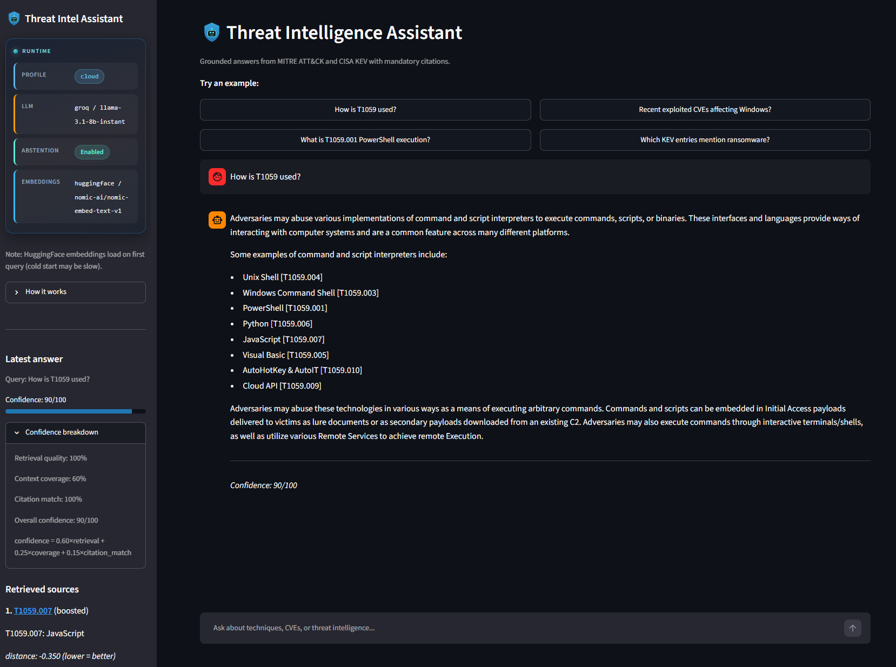

<h1 align="center">
  <picture>
    <source media="(prefers-color-scheme: dark)" srcset="docs/assets/logo-dark.svg">
    
  </picture>
</h1>

[](https://github.com/rvong65/threat-intelligence-assistant/releases)
[](https://github.com/rvong65/threat-intelligence-assistant/actions/workflows/tests.yml)
[](LICENSE)
[](https://github.com/rvong65/threat-intelligence-assistant#docker)
[](https://github.com/rvong65/threat-intelligence-assistant#features)
[](https://threat-intelligence-rag-assistant.streamlit.app/)

A **retrieval-augmented generation (RAG)** chat application that helps security analysts explore **MITRE ATT&CK** and **CISA Known Exploited Vulnerabilities (KEV)** with **grounded, cited, explainable** answers — not open-web speculation.

> **Privacy (cloud demo):** When you ask a question, the text you submit is sent to **third-party services** (Groq for answer generation; HuggingFace for query embeddings on the public demo). Do not enter classified material, credentials, or live incident details you cannot share with external APIs. See [Privacy & data handling](#privacy-data).

---

<details open>
<summary><strong>Table of Contents</strong></summary>

| Section | Description |
|---------|-------------|
| **Get started** | |
| 🚀 [Live Demo](#live-demo) | Try the Streamlit app (Cloud, local, or Docker) |
| ✨ [Features](#features) | Capabilities at a glance |
| ⚡ [Quick Start](#quick-start) | Clone, install, run, test, Docker |
| **Overview** | |
| 🎯 [Problem & Motivation](#problem-motivation) | Why grounded threat-intel RAG matters |
| 🛠️ [Tech Stack](#tech-stack) | Languages, libraries, CI |
| 📊 [Data Sources & Attribution](#data-sources) | MITRE ATT&CK + CISA KEV |
| 📌 [Version history](#version-history) | Release highlights |
| **Technical** | |
| 🏗️ [Architecture & Design Choices](#architecture-design-choices) | System design summary |
| ↳ [Full architecture doc](docs/architecture.md) | Detailed system design (Mermaid) |
| ↳ [Development Journey](#development-journey) | Build timeline diagram |
| 🛡️ [Safety Considerations](#safety-considerations) | Ethics, guardrails, and data privacy |
| 🔄 [CI/CD](#cicd) | GitHub Actions, Docker CI, Streamlit deploy |
| 📈 [Project Status & Build Log](#project-status) | Milestone checklist |
| 📁 [Repository Layout](#repository-layout) | File tree |
| **Legal & contact** | |
| 📄 [License](#license) | MIT + dataset attribution |
| 🤝 [Contact / Next Steps](#contact) | Feedback and V2 roadmap |

</details>

---

<a id="live-demo"></a>

## 🚀 Live Demo

**[▶ Open the live app on Streamlit Cloud](https://threat-intelligence-rag-assistant.streamlit.app/)**

**Before you open the app:**
- **Cold start:** This app runs on Streamlit Community Cloud and may go to sleep after inactivity. If you see **“Zzzz — This app has gone to sleep due to inactivity”**, click **“Yes, get this app back up!”** to wake it — anyone can do this; you don’t need to contact the maintainer. Startup may take a minute after you click.
- **Privacy:** The public demo uses a **cloud LLM (Groq)** and **HuggingFace embeddings**. Text you submit leaves your browser for the hosted app and is forwarded to those providers along with retrieved MITRE/KEV context. Use **general or synthetic threat-intel questions only** — not classified data, credentials, or live incident details you cannot share externally. See [Privacy & data handling](#privacy-data).

**Screenshot:**



*Illustrative example — answers are grounded in retrieved MITRE/KEV chunks; wording and results may vary. Citations and sidebar sources reflect the retrieval pipeline.*

**Or run locally:**

```powershell
streamlit run app.py
```

---

<a id="features"></a>

## ✨ Features

- **Grounded chat** — answers from retrieved MITRE ATT&CK + CISA KEV chunks only
- **Mandatory citations** — inline `[T1059]`, `[G0007]`, `[CVE-…]` with sidebar source links
- **Confidence score (0–100)** — transparent breakdown (retrieval, coverage, citation match)
- **Query guard** — blocks greetings, weather, and vague off-topic prompts
- **Hard abstention** — no speculative answer when evidence is below threshold
- **Citation validation** — flags unverified IDs in the model output
- **Metadata-aware retrieval** — entity ID boost, KEV re-ranking, keyword boost (`Windows`, etc.)
- **Multi-turn memory** — short follow-ups (e.g. *what about PowerShell?*)
- **Admin ingest panel** — local-only corpus validation and index rebuild
- **Groq error UX** — friendly rate-limit / auth messages (no stack traces in chat)

**Validation baseline (Groq cloud, `openai/gpt-oss-20b`):** 10 PASS · 2 WARN · 0 FAIL across 12 inspector-style cases.  
**Known WARN:** group queries like `G0007` may list many techniques while top-k retrieval only validates a subset — answer is useful; citation warnings are expected.

| | Local `gemma3:4b` | Cloud Groq `openai/gpt-oss-20b` |
|--|-------------------|-----------------------------------|
| Matrix | ~5 PASS / ~7 WARN | **11 PASS / 1 WARN** |
| Latency | Slower on CPU | Fast (hosted API) |
| Best for | Dev / low RAM | Demo / production UI |

---

<a id="quick-start"></a>

## ⚡ Quick Start

### Prerequisites

- Python 3.11+ **or** Docker
- **Default (cloud):** `GROQ_API_KEY` in environment or Streamlit Secrets — matches `.env.example`
- **Local Ollama path:** edit `.env` per the local block at the bottom of `.env.example` ([Ollama](https://ollama.com/) with `nomic-embed-text` and `gemma3:4b`, ~8 GiB RAM)

### Setup (Python)

```powershell
git clone https://github.com/rvong65/threat-intelligence-assistant.git
cd threat-intelligence-assistant
python -m venv .venv
.\.venv\Scripts\activate
pip install -r requirements.txt
copy .env.example .env
# Cloud: set GROQ_API_KEY in your environment (or Streamlit Secrets when deploying).
# Local: switch .env to the Ollama values in the comment block at the bottom of .env.example.
```

**First-time index build** (if not using the committed index):

```powershell
python scripts/ingest.py --build-index
```

**Run the app:**

```powershell
streamlit run app.py
```

### Docker

Cloud-profile container (port **8501**). Pass your Groq key via environment or a `.env` file in the project root:

```powershell
docker compose up --build
# or: $env:GROQ_API_KEY="your-key"; docker compose up --build
```

Optional **local Ollama** profile (adds `ollama` service — pull models after start):

```powershell
docker compose --profile local up --build
```

See [`docs/architecture.md#deployment-topologies`](docs/architecture.md#deployment-topologies) for topology details.

### Tests

```powershell
pip install -r requirements-dev.txt
pytest tests/ -q
python scripts/smoke_test.py
python scripts/validation_matrix.py
```

### Streamlit Cloud (maintainer)

Main file: **`app.py`**. In **Settings → Secrets**, mirror `.env.example` (cloud profile). Minimum:

```toml
GROQ_API_KEY = "your-groq-api-key"
```

All other keys already match repo defaults (`DEPLOYMENT_PROFILE=cloud`, Groq LLM, HuggingFace embeddings). Add explicit secrets only if you override defaults.

End-users do not provide API keys; credentials are configured by the maintainer only.

---

<a id="problem-motivation"></a>

## 🎯 Problem & Motivation

Threat analysts routinely pivot between MITRE technique pages, group profiles, software entries, and CISA KEV bulletins. General-purpose LLMs can sound confident while **hallucinating technique IDs, CVEs, or attributions** — a serious failure mode in security workflows.

This project asks: *Can a small, transparent RAG pipeline deliver fast, analyst-friendly answers that stay tied to authoritative sources?*

**Goals:**
- Ground every answer in retrieved MITRE / KEV context
- Require inline citations and surface source links in the UI
- Score confidence explicitly and abstain when evidence is weak
- Block off-topic or vague prompts before wasting retrieval + LLM calls

---

<a id="tech-stack"></a>

## 🛠️ Tech Stack


| Layer | Local development | Cloud deployment |
|-------|-------------------|------------------|
| **UI** | Streamlit (`app.py`) | Streamlit Community Cloud |
| **Orchestration** | LangChain | LangChain |
| **LLM** | Ollama `gemma3:4b` | Groq `openai/gpt-oss-20b` |
| **Embeddings** | Ollama `nomic-embed-text` | HuggingFace `nomic-ai/nomic-embed-text-v1` (pinned revision) |
| **Vector store** | FAISS (committed index) | FAISS (committed index) |
| **Config** | Pydantic Settings + `.env` | Streamlit Secrets + env |
| **Container** | Docker / docker-compose | — |
| **Tests** | pytest (49 tests) | Same pipeline via `validation_matrix.py` |
| **CI** | GitHub Actions (pytest + Docker) | — |

---

<a id="data-sources"></a>

## 📊 Data Sources & Attribution

This project indexes **MITRE ATT&CK Enterprise** STIX data and the **CISA Known Exploited Vulnerabilities (KEV)** catalog. The committed FAISS index is built from these sources only.

**Datasets used** (saved under `data/raw/`):

| File | Source | What it provides |
|------|--------|------------------|
| `enterprise-attack.json` | [MITRE ATT&CK STIX data](https://github.com/mitre-attack/attack-stix-data) | Techniques, sub-techniques, tactics, groups (`G####`), software (`S####`) |
| `known_exploited_vulnerabilities.csv` | [CISA KEV catalog](https://www.cisa.gov/known-exploited-vulnerabilities-catalog) | Actively exploited CVEs, vendors, products, remediation deadlines |

**Indexed corpus (v1.0.0):** 3,306 documents → 3,312 chunks — 697 techniques, 174 groups, 821 software, 1,614 KEV entries.

**Data freshness:** The committed FAISS index is a **point-in-time snapshot** — see `built_at` in [`indices/faiss_index/manifest.json`](indices/faiss_index/manifest.json) (currently **2026-06-10**). MITRE and CISA publish updates regularly. To refresh the corpus, run `python scripts/ingest.py --build-index` and recommit `indices/faiss_index/`.

**License compliance**

| Data | License / terms |
|------|-----------------|
| MITRE ATT&CK | © [The MITRE Corporation](https://attack.mitre.org/). Non-exclusive, royalty-free license for research, development, and commercial use — see [attack-stix-data LICENSE](https://github.com/mitre-attack/attack-stix-data?tab=License-1-ov-file#readme) and [ATT&CK Terms of Use](https://attack.mitre.org/resources/terms-of-use/). Reproduce MITRE’s copyright notice in any copy. |
| CISA KEV | [CC0 1.0 Universal](https://www.cisa.gov/sites/default/files/licenses/kev/license.txt) — public domain dedication. Does not authorize use of the CISA logo or DHS seal. |

**Models used at runtime** (not redistributed in this repo):

| Model | Role | License / acknowledgment |
|-------|------|--------------------------|
| [nomic-ai/nomic-embed-text-v1](https://huggingface.co/nomic-ai/nomic-embed-text-v1) | Cloud query embeddings (Streamlit) | [Apache 2.0](https://huggingface.co/nomic-ai/nomic-embed-text-v1) — see [Nomic Embed technical report (arXiv:2402.01613)](https://arxiv.org/abs/2402.01613) |
| `nomic-embed-text` (Ollama) | Local index build + local dev embeddings | Same model family as above |
| `gemma3:4b` (Ollama) | Local dev LLM | [Gemma Terms of Use](https://ai.google.dev/gemma/terms) |
| `openai/gpt-oss-20b` (Groq) | Cloud demo LLM | Open-weight model via Groq API — [Groq Terms](https://groq.com/terms/) |

No affiliation with MITRE, CISA, DHS, Nomic AI, or Groq. Threat intelligence data is used for educational and research purposes. Always verify critical findings against primary sources.

**Raw files are not committed.** The repo ships a pre-built index under `indices/faiss_index/` so clones work without raw data. To rebuild from scratch, place the files in `data/raw/`:

| Save as | Download |
|---------|----------|
| `data/raw/enterprise-attack.json` | [enterprise-attack.json](https://raw.githubusercontent.com/mitre-attack/attack-stix-data/master/enterprise-attack/enterprise-attack.json) |
| `data/raw/known_exploited_vulnerabilities.csv` | [known_exploited_vulnerabilities.csv](https://www.cisa.gov/sites/default/files/csv/known_exploited_vulnerabilities.csv) |

Or run `python scripts/ingest.py --build-index` — it auto-downloads equivalent MITRE/CISA URLs configured in `config/settings.py` when files are missing.

**Optional: NVD enrichment (not in default index)**  
The codebase supports *optional* CVE detail enrichment via the [NIST NVD API](https://nvd.nist.gov/) (`python scripts/ingest.py --build-index --enrich-nvd`). This is **off by default**; the committed index and live demo do **not** include `nvd_cve` documents. KEV entries link to NVD pages for citation URLs only.

---

<a id="version-history"></a>

## 📌 Version history

| Version | Highlights | Release |
|---------|------|------------|
| **[v1.1.2](https://github.com/rvong65/threat-intelligence-assistant/releases/tag/v1.1.2)** | Groq `gpt-oss-20b` migration + retrieval-only LLM fallback | [CHANGELOG](CHANGELOG.md#112---2026-07-01) |
| **[v1.1.1](https://github.com/rvong65/threat-intelligence-assistant/releases/tag/v1.1.1)** | Privacy & data disclosures (README + Streamlit sidebar) | [Releases](https://github.com/rvong65/threat-intelligence-assistant/releases/tag/v1.1.1) · [CHANGELOG](CHANGELOG.md#111---2026-06-23) |
| **[v1.1.0](https://github.com/rvong65/threat-intelligence-assistant/releases/tag/v1.1.0)** | Docker + compose, architecture docs, SVG assets, CHANGELOG, Docker CI | [Releases](https://github.com/rvong65/threat-intelligence-assistant/releases/tag/v1.1.0) · [CHANGELOG](CHANGELOG.md#110---2026-06-23) |
| **[v1.0.0](https://github.com/rvong65/threat-intelligence-assistant/releases/tag/v1.0.0)** | First tagged release — RAG MVP live on Streamlit Cloud (public since 2026-06-12) | Public since 2026-06-12; tagged 2026-06-18 · [CHANGELOG](CHANGELOG.md#100---2026-06-18) |

Full notes: [CHANGELOG.md](CHANGELOG.md)

---

<a id="architecture-design-choices"></a>

## 🏗️ Architecture & Design Choices

MITRE and KEV source data flows through **ingest → chunk → embed → FAISS**, then at query time through **guard → hybrid retrieve → abstention → grounded LLM → citation validation → Streamlit chat** (sidebar confidence, sources, and export-ready citations). Mandatory citations, transparent confidence, and hard abstention keep output analyst-ready without unconstrained open-web generation.

**Full design** — goals, end-to-end diagram, module map, deployment topologies (local / Docker / Streamlit Cloud), and architecture-level safety: **[docs/architecture.md](docs/architecture.md)**

**Key design decisions**

| Decision | Rationale |
|----------|-----------|
| **Pre-built FAISS index in repo** | Streamlit Cloud has no Ollama; ship vectors built locally, query with HF embeddings at runtime |
| **Entity ID docstore lookup** | Semantic search alone missed explicit IDs (e.g. `T1059`); direct lookup + boost fixes analyst-style queries |
| **Hard abstention** | Prefer no answer over a plausible hallucination when retrieval confidence is low |
| **Citation validation post-LLM** | Flag IDs cited but not present in retrieved chunks (visible G0007 limitation on long group lists) |
| **Dual deployment profile** | `DEPLOYMENT_PROFILE=local\|cloud` switches LLM/embedding providers without code changes |
| **Reproducibility** | Committed index + Docker image for one-command local/cloud-profile runs |

<a id="development-journey"></a>

### Development Journey

Build timeline and deployment details: [docs/architecture.md#development-journey](docs/architecture.md#development-journey).


```mermaid
flowchart LR
    A[Ingestion pipeline<br/>MITRE + KEV + groups/software] --> B[FAISS index<br/>3,312 chunks]
    B --> C[RAG core<br/>retrieve → generate → cite]
    C --> D[Streamlit UI<br/>chat + sidebar sources]
    D --> E[Responsible AI<br/>guard · abstention · confidence]
    E --> F[Retrieval tuning<br/>ID boost · KEV rerank]
    F --> G[Cloud profile<br/>Groq + HuggingFace]
    G --> H[Validation matrix<br/>11 PASS / 1 WARN / 0 FAIL]
    H --> I[GitHub + Streamlit deploy]
    I --> J[CI pipeline<br/>GitHub Actions pytest]
    J --> K[v1.1 maturity<br/>Docker · docs · assets]
```

---

<a id="safety-considerations"></a>

## 🛡️ Safety Considerations

This is a **decision-support** tool, not autonomous threat hunting or incident response automation.

| Principle | Implementation |
|-----------|----------------|
| **Grounding** | LLM prompt restricted to retrieved context |
| **Provenance** | Every claim should cite a `source_id` from retrieval |
| **Humility** | Low confidence → disclaimer or hard abstention |
| **Scope control** | Query guard rejects non–threat-intel prompts |
| **Transparency** | Sidebar shows retrieved chunks, distances, and confidence formula |
| **Privacy (cloud)** | Questions + retrieved MITRE/KEV context sent to Groq; query embeddings via HuggingFace — see [Privacy & data](#privacy-data) |
| **Resilience** | Cloud default `openai/gpt-oss-20b`; if LLM fails after retrieval, **retrieval-only fallback** returns MITRE/KEV sources without synthesis; self-host with Ollama via Docker `local` profile |
| **Known gap** | Long group technique lists vs top-k chunks → citation warnings (documented limitation) |

Always verify critical findings against primary MITRE / NVD / vendor sources. Architecture-level safety: [docs/architecture.md#security-and-safety-architecture-level](docs/architecture.md#security-and-safety-architecture-level).

<a id="privacy-data"></a>

### Privacy & data handling

Threat Intelligence Assistant is designed for **decision support**, not as a certified data-processing platform. Understand where your input goes:

| Data you submit | Where it may be sent | Notes |
|-----------------|----------------------|-------|
| Questions & follow-ups | **LLM provider** (Groq on cloud demo, or local Ollama) | Cloud: processed per [Groq Terms](https://groq.com/terms/) and their privacy policy |
| Query text (retrieval) | **Embedding provider** (HuggingFace `nomic-embed-text-v1` on cloud; Ollama locally) | Cloud cold start downloads the HF model on first query |
| Retrieved MITRE/KEV chunks | **Same LLM provider** | Grounding context from the committed FAISS index is included in the Groq/Ollama prompt |
| Multi-turn memory | **Same LLM provider** | Recent turns in the session may be included for follow-up questions |
| Session chat history | **Streamlit session memory** | Cleared when the session ends; **not** written to a project database by this app |
| Sidebar exports / citations | Your browser only | Links point to public MITRE / NVD / CISA pages |

**Public Streamlit Cloud demo:** Treat it like any shared SaaS chat UI — **no classified data, credentials, PII, or live production incident details** you cannot share with Groq or HuggingFace. Prefer the built-in **example queries** or synthetic analyst-style questions for testing.

**Sensitive environments:** Run locally or in Docker with **`DEPLOYMENT_PROFILE=local`** and **`LLM_PROVIDER=ollama`** so answer generation stays on your network. Query embeddings can also use Ollama (`EMBEDDING_PROVIDER=ollama`); HuggingFace is not required on that profile.

**Maintainer:** This repo does not intentionally log chat content to disk. Streamlit Community Cloud, Groq, and HuggingFace may retain operational or API logs under their own policies — review their documentation if compliance matters.

---

<a id="cicd"></a>

## 🔄 CI/CD

**GitHub Actions** runs on every push and pull request to `main` / `master`:

| Job | Step | Action |
|-----|------|--------|
| **pytest** | Trigger | Push or PR to `main` / `master` |
| | Environment | `ubuntu-latest`, Python 3.11 |
| | Install | `pip install -r requirements-dev.txt` |
| | Test | `pytest tests/ -q` |
| **docker** | Build | `docker build -t threat-intel-assistant:ci .` |
| | Health | Streamlit `/_stcore/health` on port 8501 |

Workflow file: [`.github/workflows/tests.yml`](.github/workflows/tests.yml)

Loader and unit tests use **fixtures** or skip when `data/raw/` is absent. FAISS retriever integration runs against the **committed index** in CI using lightweight fake query embeddings for entity-ID coverage; semantic KEV ranking tests run locally with real embedding models. **`smoke_test.py`** and **`validation_matrix.py`** are maintainer scripts (require API keys / Ollama) and are not part of the CI workflow.

**Streamlit Cloud** deploys independently from the `main` branch when connected to this repository (`app.py` + `requirements.txt`).

---

<a id="project-status"></a>

## 📈 Project Status & Build Log

| Step | Focus | Status |
|------|-------|--------|
| **1** | Data ingestion — MITRE ATT&CK, CISA KEV, groups & software loaders | ✅ |
| **2** | RAG pipeline — FAISS index, retrieval, citations, confidence scoring | ✅ |
| **3** | Streamlit UI — chat, sidebar sources, conversational memory | ✅ |
| **4** | Responsible AI — query guard, hard abstention, citation validation | ✅ |
| **5** | Retrieval tuning — entity ID boost, KEV detection, metadata rerank | ✅ |
| **6** | Cloud integration — Groq LLM, HuggingFace embeddings, error UX | ✅ |
| **7** | Validation & deploy — matrix baseline, GitHub repo, Streamlit Cloud | ✅ |
| **8** | CI — GitHub Actions pytest workflow on push/PR | ✅ |
| **9** | v1.1 — Docker, architecture docs, assets, CHANGELOG, Docker CI | ✅ |
| **10** | v1.1.1 — Privacy & data disclosures (README + Streamlit sidebar) | ✅ |
| **11** | v1.1.2 — Groq gpt-oss-20b migration + retrieval-only LLM fallback | ✅ |

**Current status:** ✅ v1.1.2 — live on Streamlit Cloud; pytest + Docker CI on `main`

---

<a id="repository-layout"></a>

## 📁 Repository Layout

```
threat-intelligence-assistant/
├── .github/workflows/
│   └── tests.yml          # CI: pytest + Docker health check
├── .streamlit/
│   └── config.toml        # Streamlit theme (secrets.toml is gitignored)
├── docs/
│   ├── architecture.md    # Full system design
│   ├── assets/            # logo-light/dark, icon, favicon SVGs
│   └── screenshots/       # README demo images
├── app.py                 # Streamlit entry point
├── config/                # Pydantic settings, deployment profiles
├── src/
│   ├── embeddings/        # Ollama / HuggingFace embedding factory
│   ├── ingestion/         # Chunking, normalization
│   ├── llm/               # Ollama / Groq LLM factory, error mapping
│   ├── loaders/           # MITRE, KEV, groups/software (optional NVD at ingest)
│   ├── models/            # Document schema
│   ├── rag/               # Chain, retriever, guard, citations, confidence
│   └── vectorstore/       # FAISS load/build
├── scripts/
│   ├── ingest.py          # Download, validate, build index
│   ├── smoke_test.py      # Pipeline smoke test (local / maintainer)
│   └── validation_matrix.py
├── indices/faiss_index/   # Committed FAISS index (index.faiss, index.pkl, manifest.json)
├── tests/                 # pytest suite (49 tests)
│   └── fixtures/          # Sample MITRE/KEV files for loader tests
├── data/raw/              # Gitignored — downloaded at ingest
├── data/processed/        # Gitignored — regenerated at ingest
├── Dockerfile             # Cloud-profile Streamlit image
├── docker-compose.yml     # app (+ optional Ollama local profile)
├── .dockerignore
├── requirements.txt       # App + Streamlit Cloud runtime deps
├── requirements-dev.txt   # Dev deps (includes pytest)
├── CHANGELOG.md           # Version-by-version change history
├── .env.example
├── .gitignore
└── LICENSE                # MIT
```

---

<a id="license"></a>

## 📄 License

**MIT License** — see [LICENSE](LICENSE).

MITRE ATT&CK ([license](https://github.com/mitre-attack/attack-stix-data?tab=License-1-ov-file#readme)) and CISA KEV ([CC0 1.0](https://www.cisa.gov/sites/default/files/licenses/kev/license.txt)) remain subject to their respective terms. This project is not affiliated with MITRE, CISA, DHS, or Groq.

---

<a id="contact"></a>

## 🤝 Contact / Next Steps

Open to feedback, suggestions, and mission-aligned collaboration.

### V2 roadmap (planned)

| Area | Direction |
|------|-----------|
| **RAG quality** | HF-aligned index rebuild; full-document citation validation (G0007-style fixes) |
| **Data** | Optional NVD enrichment at ingest; periodic MITRE/KEV refresh workflow |
| **GenAI / eval** | RAG evaluation in CI (e.g. RAGAS); optional LangSmith tracing |
| **Product** | FastAPI layer for programmatic access; voice input / TTS for analyst queries |
| **Ops** | CPU-only Docker image; embedding model pre-cache for faster cold start |

---
