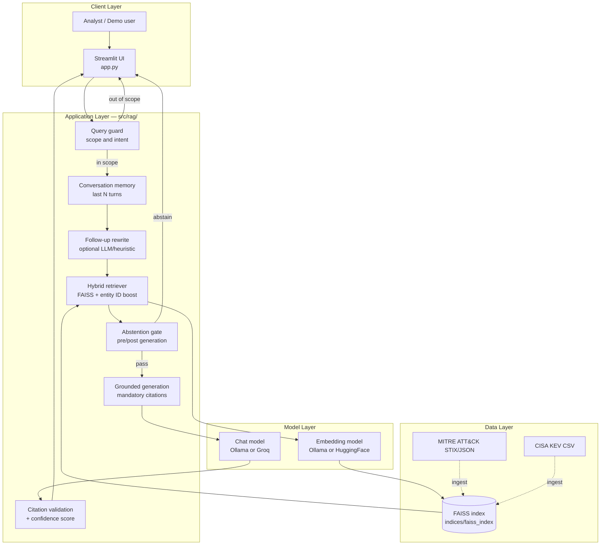

# Architecture & System Design

Full system design for Threat Intelligence Assistant (v1.1.0).  

---

## Goals

| Goal | Approach |
|------|----------|
| **Grounded answers** | Retrieve MITRE / KEV chunks first; LLM prompt restricted to retrieved context only |
| **Provenance** | Mandatory inline citations (`[T1059]`, `[G0007]`, `[CVE-…]`) with sidebar source links |
| **Explainable uncertainty** | Transparent confidence score (0–100) and hard abstention when evidence is weak |
| **Analyst-style queries** | Hybrid retrieval: FAISS similarity + entity-ID docstore lookup + KEV/metadata boost |
| **Scope control** | Query guard blocks off-topic prompts before retrieval / LLM spend |
| **Reproducible deploy** | Committed FAISS index; dual `local` / `cloud` profiles; Docker for one-command runs |

---

## End-to-end system diagram



**Request lifecycle (in scope):**

1. User submits a question in Streamlit.
2. **Query guard** accepts or rejects (greetings, weather, vague off-topic → reject).
3. **Memory** supplies recent turns for short follow-ups.
4. **Optional rewrite** expands elliptical follow-ups (local profile; disabled on cloud).
5. **Retriever** embeds the query, searches FAISS, applies entity-ID lookup and boosts.
6. **Abstention** checks retrieval confidence against threshold (default 40).
7. **LLM** generates an answer grounded in retrieved chunks with required citations.
8. **Citation validation** flags IDs cited but not present in retrieved `source_id` set.
9. **Confidence** blends retrieval, coverage, and citation match; UI shows breakdown.

---

## Repository modules

| Module | Role |
|------|----------------|
| [`app.py`](../app.py) | Streamlit entry: chat UI, sidebar config, example queries, local admin ingest panel |
| [`config/settings.py`](../config/settings.py) | Pydantic settings, `local` / `cloud` profiles, paths, ingest URLs |
| [`src/loaders/`](../src/loaders/) | Parse MITRE STIX, CISA KEV CSV, groups/software; optional NVD enrichment |
| [`src/ingestion/`](../src/ingestion/) | Chunking, normalization, `documents.jsonl` |
| [`src/embeddings/factory.py`](../src/embeddings/factory.py) | Ollama or HuggingFace embedding clients |
| [`src/llm/factory.py`](../src/llm/factory.py) | Ollama or Groq chat models; error mapping |
| [`src/vectorstore/factory.py`](../src/vectorstore/factory.py) | Build/load FAISS index, manifest |
| [`src/rag/chain.py`](../src/rag/chain.py) | RAG orchestration: guard → retrieve → generate → validate |
| [`src/rag/retriever.py`](../src/rag/retriever.py) | Hybrid retrieval, entity boost, KEV re-ranking |
| [`src/rag/citations.py`](../src/rag/citations.py) | Extract and validate cited IDs |
| [`src/rag/confidence.py`](../src/rag/confidence.py) | Weighted confidence score |
| [`src/rag/query_guard.py`](../src/rag/query_guard.py) | Off-topic / greeting detection |
| [`scripts/ingest.py`](../scripts/ingest.py) | Download raw data, build FAISS index |
| [`scripts/validation_matrix.py`](../scripts/validation_matrix.py) | 12-case inspector-style evaluation (maintainer) |
| [`indices/faiss_index/`](../indices/faiss_index/) | Committed vectors + `manifest.json` |
| [`tests/`](../tests/) | pytest suite (49 tests) |

---

## Pipeline summary

### Ingestion (offline / maintainer)

```
MITRE STIX JSON + CISA KEV CSV
  → loaders (techniques, groups, software, KEV documents)
  → chunking (metadata: source_id, source_type, platforms, vendor, …)
  → batch embed (Ollama locally, or HuggingFace)
  → FAISS index + manifest.json
```

Raw files live under `data/raw/` (gitignored). The public repo ships a **pre-built index** so clones and Streamlit Cloud need no ingest step.

### Query-time (online)

```
User question
  → query guard
  → embed query (Ollama or HuggingFace)
  → FAISS similarity + entity docstore lookup + boosts
  → abstention gate
  → Groq / Ollama LLM (retrieved context only)
  → citation validation + confidence
  → Streamlit UI
```

**Indexed corpus (v1.0.0):** 3,306 documents → 3,312 chunks — 697 techniques, 174 groups, 821 software, 1,614 KEV entries.

---

## Key design decisions

| Decision | Rationale |
|----------|-----------|
| **Pre-built FAISS index in repo** | Streamlit Cloud has no Ollama; ship vectors built locally, query with HF embeddings at runtime |
| **Entity ID docstore lookup** | Semantic search alone missed explicit IDs (e.g. `T1059`); direct lookup + boost fixes analyst-style queries |
| **Hard abstention** | Prefer no answer over a plausible hallucination when retrieval confidence is low |
| **Citation validation post-LLM** | Flag IDs cited but not present in retrieved chunks (visible G0007 limitation on long group lists) |
| **Dual deployment profile** | `DEPLOYMENT_PROFILE=local\|cloud` switches LLM/embedding providers without code changes |
| **Pinned HF embed revision** | Avoid silently executing new remote modeling code on each cold start |
| **Factory pattern for LLM/embeddings** | Swap Ollama ↔ Groq / HuggingFace via settings only |
| **pytest + validation matrix** | Unit tests in CI; inspector matrix for maintainer Groq/Ollama validation |

**Known limitation:** Index vectors were built with Ollama `nomic-embed-text`; cloud queries use HuggingFace `nomic-ai/nomic-embed-text-v1`. Same model family, not identical embedding space. A future release may rebuild with HF `search_document:` / `search_query:` prefixes.

---

## Development journey

```mermaid
flowchart LR
    A[Ingestion pipeline<br/>MITRE + KEV + groups/software] --> B[FAISS index<br/>3,312 chunks]
    B --> C[RAG core<br/>retrieve → generate → cite]
    C --> D[Streamlit UI<br/>chat + sidebar sources]
    D --> E[Responsible AI<br/>guard · abstention · confidence]
    E --> F[Retrieval tuning<br/>ID boost · KEV rerank]
    F --> G[Cloud profile<br/>Groq + HuggingFace]
    G --> H[Validation matrix<br/>11 PASS / 1 WARN / 0 FAIL]
    H --> I[GitHub + Streamlit deploy]
    I --> J[CI pipeline<br/>GitHub Actions pytest]
    J --> K[v1.1 maturity<br/>Docker · docs · assets]
```



| Phase | Focus |
|-------|-------|
| **1** | Data ingestion — MITRE ATT&CK, CISA KEV, groups & software loaders |
| **2** | RAG pipeline — FAISS index, retrieval, citations, confidence |
| **3** | Streamlit UI — chat, sidebar sources, conversational memory |
| **4** | Responsible AI — query guard, hard abstention, citation validation |
| **5** | Retrieval tuning — entity ID boost, KEV detection, metadata rerank |
| **6** | Cloud integration — Groq LLM, HuggingFace embeddings, error UX |
| **7** | Validation & deploy — matrix baseline, GitHub, Streamlit Cloud |
| **8** | CI — GitHub Actions pytest on push/PR |
| **9** | v1.1 — Docker, architecture docs, assets, CHANGELOG, Docker CI |

---

## Deployment topologies

### Local development

- **Stack:** `streamlit run app.py`, Python 3.11+, `.env` from `.env.example`
- **Cloud profile (default):** `GROQ_API_KEY` in environment; HuggingFace embeddings on first query
- **Ollama profile:** set `DEPLOYMENT_PROFILE=local` — `gemma3:4b` + `nomic-embed-text` via Ollama
- **Index:** use committed `indices/faiss_index/` or rebuild with `python scripts/ingest.py --build-index`
- **Tests:** `pip install -r requirements-dev.txt` → `pytest tests/ -q`

### Docker

- **Image:** [`Dockerfile`](../Dockerfile) — Python 3.11-slim, runtime deps only, committed FAISS index
- **Compose:** [`docker-compose.yml`](../docker-compose.yml) — `docker compose up --build` on port **8501**
- **Secrets:** pass `GROQ_API_KEY` via compose `environment` or `.env` (never bake into image)
- **Optional profile `local`:** adds Ollama service; user must pull models inside the Ollama container
- **CI:** GitHub Actions builds image and hits Streamlit `/_stcore/health`

### Streamlit Cloud

- **Entry:** `app.py` + `requirements.txt` (no dev deps, no Docker)
- **Secrets:** minimum `GROQ_API_KEY`; other keys match cloud defaults in `.env.example`
- **Deploy:** automatic on push to `main` when repo is connected
- **Cold start:** HuggingFace embedding model download on first query (30–60s+)

---

## Security and safety (architecture-level)

| Concern | Mitigation |
|---------|------------|
| **Hallucinated technique/CVE IDs** | Grounding + mandatory citations + post-LLM citation validation |
| **Overconfident wrong answers** | Confidence score + hard abstention below threshold |
| **Off-topic / abuse** | Query guard before retrieval and LLM calls |
| **API key exposure** | `.env` and `secrets.toml` gitignored; Groq key only in Streamlit Secrets / env |
| **Cloud inference privacy** | Questions + retrieved context sent to Groq; documented in UI “How it works” |
| **Deserialization risk** | FAISS `allow_dangerous_deserialization=True` only for maintainer-built index in repo |
| **Decision support only** | Not autonomous IR or threat hunting; verify against primary sources |

---

## Version

Document version: v1.1.0 (aligned with [CHANGELOG.md](../CHANGELOG.md#110---2026-06-23))

| Release | Architecture highlights |
|---------|------------|
| **v1.1.0** | Engineering maturity — Docker, `docs/architecture.md`, SVG assets, CHANGELOG, Docker CI |
| **v1.0.0** | RAG MVP — MITRE + KEV index, Streamlit Cloud, Groq cloud profile, pytest CI |

